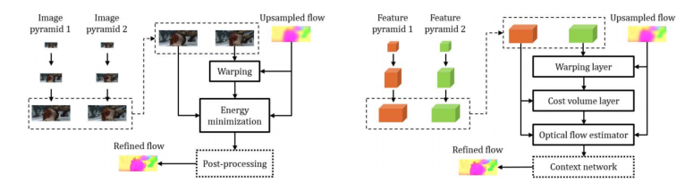
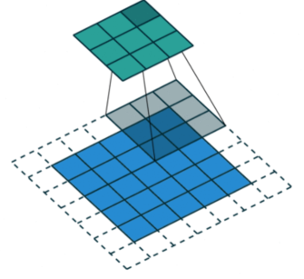
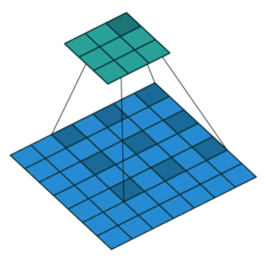
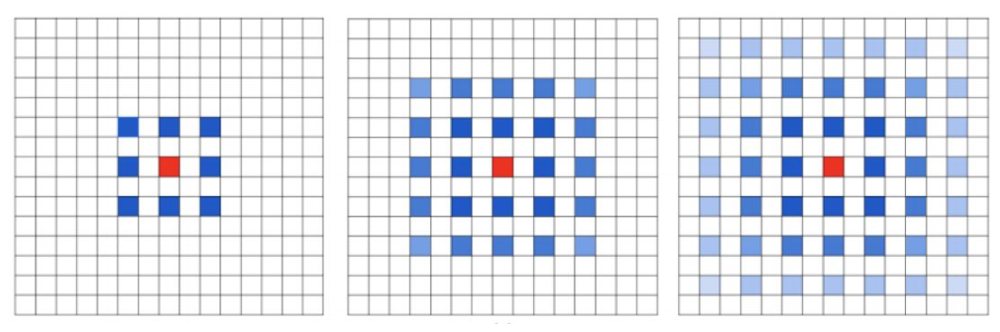
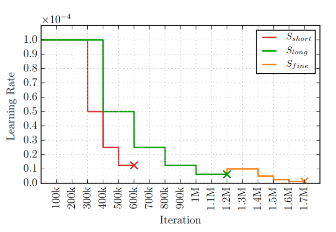

## PWC-Net学习笔记
[论文地址](https://arxiv.org/abs/1612.01925)  
[代码地址](https://github.com/Kerorohu/PWC-Net)

### 概述
PWC-Net相对于FlowNet2的模型大小小17倍  

  1. 优势：速度快、参数量少
  2. 劣势：相比最新的模型相比准确率要差一点  

### 卷积神经网络架构  

#### 特征金字塔
- 从原始特征图开始每层金字塔向下降采样2倍（一共六层
- 降采样方法位使用卷积滤波器
- 特征通道的数量分别为16,32,64,96,128和196
#### 翘曲层（Warping layer）
理论来自：[High Accuracy Optical Flow Estimation Based on aTheory for Warping](sci-hub.se/10.1007/978-3-540-24673-2_3)
**作用**：对于非平移运动，翘曲可以补偿一些几何畸变，使输出更平滑。
**方法**：将每层金字塔得到的光流上采样与金字塔每层的特征图进行双线性插值。
>**双线性插值**在数学上，双线性插值是有两个变量的插值函数的线性插值扩展，其核心思想是在两个方向分别进行一次线性插值    

$$c^l_w(x)=c^l_2(x+up_2(w^{l+1})(x))$$
#### 成本量计算层  
使用了一个公式将两帧之间关联起来
$$cv^l(x_1,x_2)=\frac{1}{N}(c^l_1(x_1))^Tc^l_w(x_2)$$
并且设计了一个卷积范围与FlowNet中类似:$|x1-x2|_\infty\leq d$
#### 光流估计CNN层  
光流估计层由5个CNN组成，输入为成本量.  
在金字塔的每一层均有五个通道为128、128、96、64、32的卷积层，并不共享参数.
并且使用了DenseNet[^1]的卷积架构，每一层卷积的输入是其上一层的输出和输入.

[^1]:G. Huang, Z. Liu, K. Q. Weinberger, and L. van der Maaten.Densely connected convolutional networks. In IEEE Conference on Computer Vision and Pattern Recognition (CVPR),2017. 3, 4
#### Context Network  
##### 空洞卷积（dilated convolutions）
**作用**：
- 解决空间层级化信息丢失的问题
- 解决小物体/小位移精度低的问题  

**方法**：往标准卷积中注入空洞

普通卷积示意图

  
空洞卷积示意图

**问题**：假设我们仅仅多次叠加 dilation rate 2 的 3 x 3 kernel 的话，则会出现：  
损失了信息的连续性。
##### Hybrid Dilated Convolution 标准化设计
**作用**：增加卷积层的感受野
**方法**：上下文网络基于空洞卷积，由7个卷积层构成，每个卷积层的空间核是3*3.但是每层具有不同的膨胀系数，分别为1，2，4，8，16，1，1

#### 损失函数
与FlowNet[^2]中相同的多尺度训练损失
[^2]:A. Dosovitskiy, P. Fischery, E. Ilg, C. Hazirbas, V. Golkov,P. van der Smagt, D. Cremers, T. Brox, et al. FlowNet:Learning optical flow with convolutional networks. In IEEE International Conference on Computer Vision (ICCV), 2015.1, 2, 3, 4, 5

### 训练策略  
**总体顺序**：FlyingChairs >> FlyingThings3D >> Sintel
**原因**：在更简单的FlyingThings上可以帮助网络学习色彩匹配的一般概念，而不会让3D运动和照明产生先验混淆  

**详细顺序**：
1. 在FlyingChairs上按照Slong对学习率进行调整，节点在迭代次数为0.4M, 0.6M, 0.8M, and 1M时调整。batch-size为8、图像大小为488 * 348
2. 在FlyingThings3D上继续微调，按照Sfine的调整路线调整学习率。batch-size为4、图像大小为768 * 348
3. 在MPI Sintel上继续微调，数据增强中添加水平翻转，并消除附加噪声，batch-size为4，图图像大小为768 * 348

### 数据库
[KITTI2015](http://www.cvlibs.net/datasets/kitti/eval_scene_flow.php?benchmark=flow)  
[Sintel](http://sintel.is.tue.mpg.de/downloads)
[FlyingThings](https://lmb.informatik.uni-freiburg.de/data/SceneFlowDatasets_CVPR16/Release_april16/data/FlyingThings3D/derived_data/flyingthings3d__optical_flow.tar.bz2)
[FlyingChairs](https://lmb.informatik.uni-freiburg.de/data/FlyingChairs/FlyingChairs.zip)

## PWC-Net Pytorch实现
包含训练实现 https://github.com/RanhaoKang/PWC-Net_pytorch  
本人模型改进及数据增强实现：https://github.com/Kerorohu/DS-PWC-pytorch
win10下运行demo 命令：
预测：
```
python3 main.py --input-norm --batch-norm --residual --corr_activation pred --load example/SintelFinal-200K-noBN_SintelFinal-148K-BN.pkl -i example/1.png example/2.png
```
训练：
```
python main.py --input-norm --batch-norm --residual --corr_activation --num_workers 4 train --dataset FlyingChairs --dataset_dir D:\DataSet\FlyingChairs_release\data --batch_size 4 --mixup//--load D:\Project\GithubProject\PWC-Net_pytorch\train_log\20201222-141830\500.pkl
```
```
python3 main.py --input-norm --batch-norm --residual --corr_activation --num_workers 8 train --dataset FlyingChairs --dataset_dir /home/tp/keroro/download/dataset/FlyingChairs_release/data/ --batch_size 8 --mixup --lr 1e-4
```

### 代码参数设置
|参数名称|参数类型|参数意义|默认值|
|-|-|-|:-:|
|device|string|是否使用gpu|cuda|
|num_workers|int|工作进程|8|
|input-norm|store_true|输入归一化|false|
|rgb_max|float|色彩最大值|255|
|batch-norm|store_true|网络层归一化|false|
|lv_chs|int|没懂|3, 16, 32, 64, 96, 128, 192|
|output_level|int|没懂|4|
|corr|string|计算相关层得方法|cost_volume|
|search_range|int|相关层范围d|4|
|corr_activation|store_true|成本量计算层激活层|false|
|residual|store_true|残差|false|
|input_shape|int|输入图片得形状|(3, 2, 384, 448)|
|**参数统计**|---------|----------|----------|
|summary||参数统计|
|i / input_shape|int|输入数据的大小|（3,2,384,448）|
|**训练参数**|---------|---------|----------|
|corp_type|string|没懂|random|
|load|string|读取预训练模型|无|
|dataset|string|数据集类型|无|
|dataset_dir|string|数据集地址|无|
|lr|科学计数法|学习率设置|1e-4|
|optimizer|string|优化器选择|Adam|
|total_step|int|总迭代次数|200 * 1000|
|**数据增强参数**|----------|-----------|-------------|
|mixup|store_true|数据增强-mixup|false|
|mixup_alpha|float|mixup比例波动系数|0.2|
|mixup_prb|float|mixup增强概率|0.5|
|no_transforms|store_false|数据增强-颜色变化-擦除|True|
|erasing|float|数级增强-擦除概率|0.7|
|**预测参数**|---------|---------|----------|
|i / input|string|两张图片的地址|无|
|o / output|string|输出.flo的地址|无|

### 模型参数
**PWC-Net**：8.63M
**改进模型**：1.06M/1.96M

## 备注
### anaconda配置
**创建配置文件**：`conda env export > pwc.yaml`
**使用配置文件导入**:`conda env create -f pwc.yaml`
考虑IEICE
https://blog.csdn.net/sinat_23619409/article/details/85220561

mixup相关理论
https://blog.csdn.net/u013841196/article/details/81049968
python3 main.py --input-norm --batch-norm --residual --corr_activation --num_workers 8 train --dataset FlyingChairs --dataset_dir /home/tp/keroro/download/dataset/FlyingChairs_release/data/ --batch_size 8 --lr 2.5e-5 --total_step 200000 --log_dir /home/tp/keroro/log/FlyingChairs800k_bn --load /home/tp/keroro/log/FlyingChairs600k_bn/20000.pkl --mixup
